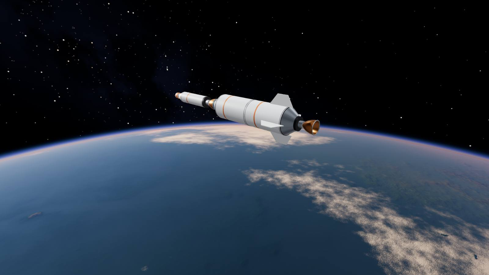
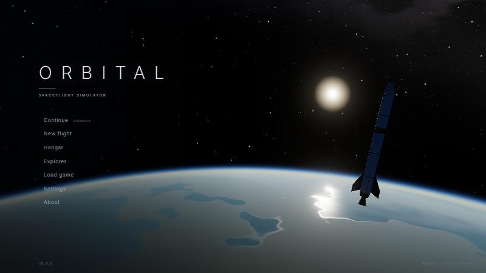
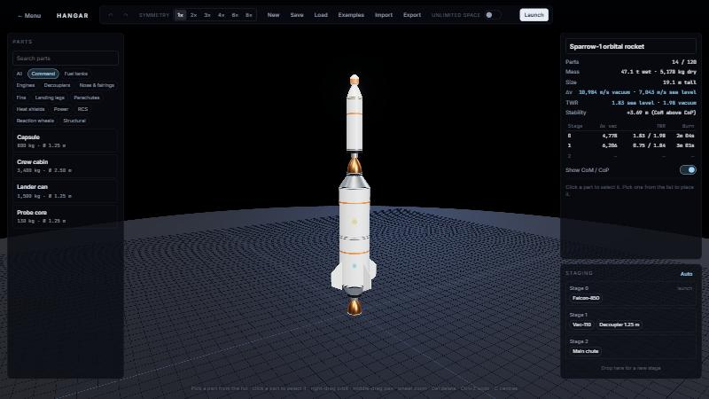
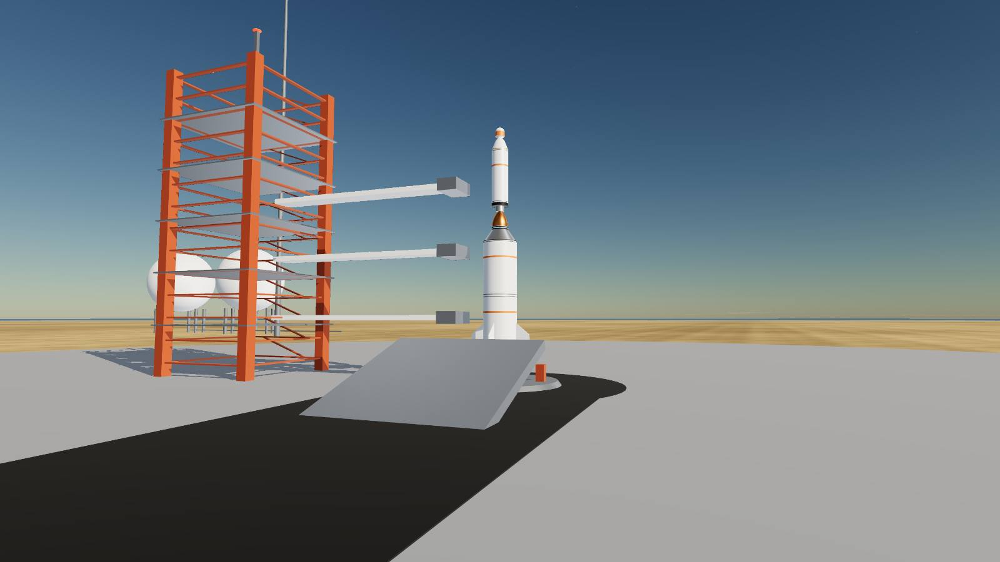
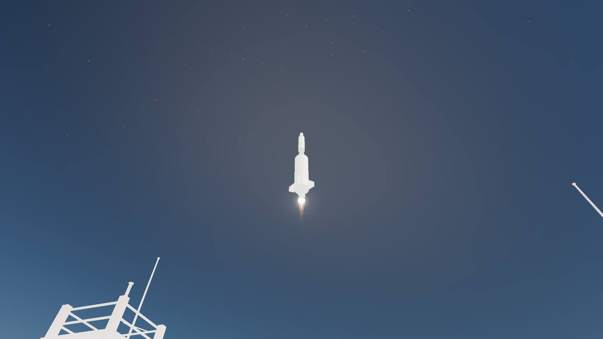
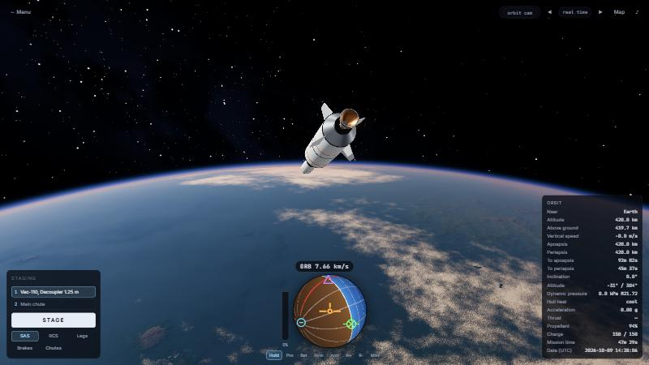
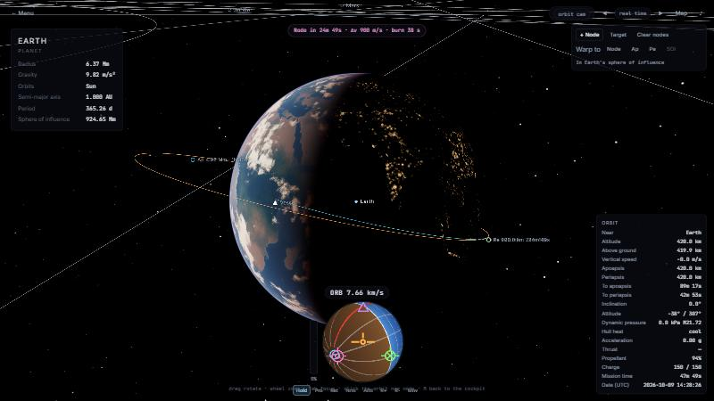
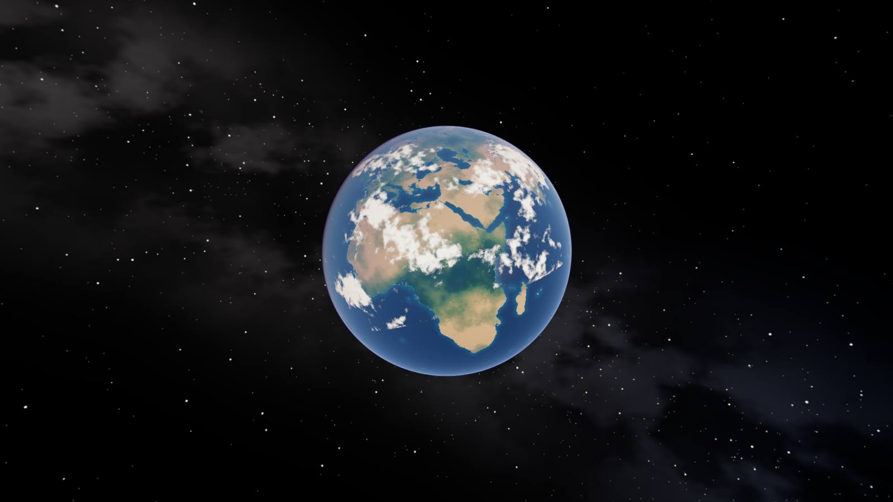
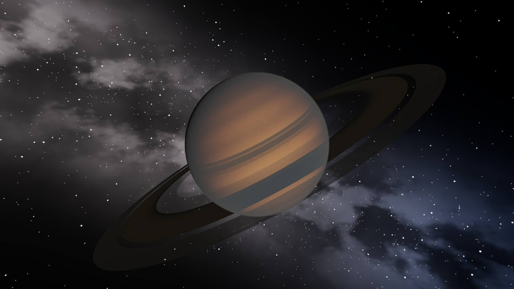

# Orbital

A real-scale spaceflight simulator that runs entirely in your browser. Build a rocket in the Hangar, launch it from Cape Canaveral, reach orbit by hand, plan transfers with maneuver nodes, land on the Moon and come home through re-entry, or just fly a free camera across the whole solar system.
No server, no accounts, no downloads while you play: everything is bundled or generated procedurally, and saves live in your browser.



> **Version 1.0.0.** All eight phases of the plan are done. See [CHANGELOG.md](CHANGELOG.md) for the history and [MEMORY.md](MEMORY.md) for architecture notes, decisions and known gaps.

| | |
|---|---|
|  |  |
|  |  |
|  |  |
|  |  |

## What is in it

- **Real scale.** 21 bodies with real radii, masses, spin and positions from the JPL ephemeris, Earth terrain from NASA elevation data, procedural terrain for every other rocky world, atmospheres, clouds, eclipses, Saturn's rings.
- **A rocket builder** with 51 parts, symmetry, staging, live delta-v and thrust-to-weight, example crafts including a complete Moon mission.
- **Flight physics.** 6-DOF vessels at 120 Hz, atmosphere and aerodynamics, gimbal, RCS, SAS, parachutes, landing legs, structural breakup, re-entry heating.
- **Navigation.** Patched-conic trajectories, maneuver nodes, time warp on rails up to 100,000x, sphere-of-influence hand-overs, targets and closest approach.
- **Saves, settings, cheats, sound.** Save slots with thumbnails, quick save, autosave, export and import; key rebinding; a cheats menu; synthesised engine sound and ambient music; first-time hints.

## Run it

```bash
npm install
npm run dev        # http://localhost:5173
npm test           # unit tests
npm run build      # static site in dist/
npm run preview    # serve the production build
```

Requires a current Chrome, Edge, Firefox or Safari. Orbital uses WebGPU when available and falls back to WebGL 2 automatically.
Add `?backend=webgl2` to the URL to force the compatibility renderer.

## Hangar controls

| | |
|---|---|
| Pick a part in the list, then **click** | place it on a free node (green ghost) or on a part's side; keep clicking to place more |
| **Click** a part | select it (outline); symmetry copies are selected together |
| **Right-drag** / **middle-drag** / wheel | orbit / pan / zoom (**Home** re-frames) |
| **Q E** | turn the part being placed, or the selected part (**Shift** for bigger steps) |
| **R F** | slide a side-mounted part up / down · **F** while placing flips the part |
| **X** | cycle symmetry 1×, 2×, 3×, 4×, 6×, 8× |
| **Del** · **Ctrl+C / V** · **Ctrl+Z / Y** | delete · copy and paste · undo and redo |
| **C** | show or hide centre of mass (yellow) and centre of pressure (blue) |
| **Esc** | cancel placing, then deselect, then back to the menu |

The right panel shows mass, delta-v, thrust-to-weight and a stage table; the staging box under it lets you drag parts between stages.
Crafts autosave and come back when you reopen the Hangar. Save/Load use the browser's IndexedDB; Export/Import use `.json` files.

## Flight controls

| | |
|---|---|
| **Z** / **X** · **Shift** / **Ctrl** | full throttle / cut · raise / lower throttle |
| **Space** | stage (first press lights the engines, later presses separate stages) |
| **W S** · **A D** · **Q E** | pitch · yaw · roll |
| **T** · **Y** / **U** | SAS on/off · next / previous SAS mode (hold, prograde, retrograde, normal, anti-normal, radial out/in, maneuver) |
| **R** · **I K J L H N** | RCS on/off · RCS translation |
| **G** · **B** · **P** | landing legs · brakes · arm parachutes |
| **C** · mouse drag / wheel | camera (orbit, pad, nose) · turn / zoom the orbit camera |
| **, .** / **/** | time warp down / up (physics ×1-4, then rails ×10 … ×100,000) / real time |
| **M** · **V** · **F2** · **Esc** | map · mute · hide HUD · pause menu |
| **F5** · **F9** · **F10** · **F3** | quick save · quick load · cheats menu · debug overlay |

A gamepad also works (sticks steer, triggers set throttle, face buttons stage / SAS / RCS / legs). Add `?pad=off` to ignore it.
Tilt over gently after clearing the tower and keep the nose near prograde through the thick air; a rocket without fins or with too much thrust fails in believable ways.

Every flight key can be changed in **Settings > Controls**; the pause menu has a list of the current keys.

## Saving, settings and cheats

Press **F5** to quick save and **F9** to quick load; the pause menu (**Esc**) has *Save and load* for named saves, with thumbnails, export to a file and import. The game saves itself every two minutes and when you leave a flight, and *Continue* on the main menu picks up the latest save. Saves live in your browser (IndexedDB); export a file to back one up. *Settings* has graphics (preset, resolution scale, shadows, effects density, bloom, clouds, terrain detail, field of view, frame limit), audio levels, key rebinding, gamepad, units, hints and interface scale. The **Cheats** menu (F10, or the pause menu) offers unlimited fuel, invulnerability, no heating or aerodynamics, zero gravity, unlimited time warp, teleports to orbit or the ground anywhere, a clock jump and more. Cheats are remembered, shown by a badge in the HUD, and never change a save file.

## The map and maneuvers

Press **M** in flight. Drag to rotate, wheel to zoom, **Tab** to change focus. The cyan line is your orbit; after a burn node it continues in orange, and a sphere-of-influence change starts a new patch about the next body. **Click the orbit** (or press **+ Node**) to add a maneuver node, then set its prograde, normal and radial delta-v and its time in the panel. The HUD shows the countdown and burn time; SAS **Mnv** points at the burn and the pink marker on the navball is the direction to burn. Start the burn half the burn time before the node and cut when the remaining delta-v reaches zero. Focus a moon and press **Target** to mark your closest approach to it. **Warp to** jumps to the node, apoapsis, periapsis or the next change of sphere of influence; time warp on rails stops by itself at the top of the atmosphere and near the ground.

A Moon trip, in short: reach low Earth orbit; place a node about 3.1 km/s prograde and slide it round the orbit until the map shows a Moon encounter; fly it; correct the course on the way; burn retrograde at the Moon to be captured; land with the descent stage (legs out, **G**), take off with the ascent stage, burn for Earth, drop the service module and ride the heat shield and parachutes home. The **Selene** example is a complete rocket for it.

## Explorer controls

| | |
|---|---|
| **W A S D** / **R F** or Space C | move / up, down |
| Mouse (click to capture) / wheel | look / change speed |
| Shift / Ctrl | fast / slow · **Q E** roll in space |
| **1–8, 9, 0** | teleport: Earth orbit, Alps, Everest, Moon orbit, Moon surface, Earth afar, reef, sunset, Saturn, Mars |
| **Tab** / **M** | fly to next body / solar-system map (drag rotate, wheel zoom, click label to focus, Enter fly there) |
| **, .** / **/** | slower / faster warp (up to 100,000x; map up to 10,000,000x) / real time |
| **[ ]** | ±1 hour (Shift: ±1 day); the time panel has a jump-to-date box |
| **G**, **F3**, **Esc** | ground collision, overlay, back to menu |

Speed scales with altitude, so the trip from deep space to the ground takes seconds and walking pace is available at the surface.

## Tech

Vite · TypeScript · three.js (WebGPU renderer with TSL shaders, WebGL 2 fallback) · Web Workers · Vitest. Fonts: Inter and JetBrains Mono (SIL Open Font License, see `src/assets/fonts`).

Earth data: NASA Visible Earth heightmap and Natural Earth populated places (both public domain), baked by the scripts in `tools/` into `src/assets/data/`.
URL flags: `?backend=webgl2` (compatibility renderer), `?depth=standard` (no reversed-Z), `?profile` (GPU timing), `?pad=off` (ignore gamepads).

## Quality settings and performance

*Settings > Graphics* has four presets and every option behind them (resolution scale, bloom, anti-aliasing, shadows, clouds, terrain detail, effects density, field of view, frame limit). Rough guide:

| Preset | Meant for | Notes |
|---|---|---|
| Low | integrated graphics, laptops on battery | 0.65x resolution, no bloom or MSAA, no shadows, coarse terrain |
| Medium | mainstream GPUs (default) | 0.85x resolution, bloom, shadows 1024 |
| High | recent discrete GPUs | full resolution, MSAA, shadows 2048 |
| Ultra | high-end GPUs and screenshots | 1.25x resolution, shadows 4096, finest terrain |

The debug overlay (**F3**) shows frame rate, frame time (add `?profile` for GPU time where the browser allows), terrain chunks drawn and resident, and the physics step.
A browser without WebGPU (current Firefox and Safari releases may not have it enabled) falls back to WebGL 2 on its own; add `?backend=webgl2` to force it. Memory use is dominated by terrain chunks (about 0.6 GB of JavaScript heap at High and 0.4 GB at Medium, measured in Chrome).

## Deploying to GitHub Pages

The repository includes `.github/workflows/deploy.yml`, which runs the tests, builds the site and publishes `dist/` to GitHub Pages on every push to `main`.

1. Create an empty repository on GitHub (for example `orbital`; no README, no licence, no `.gitignore`).
2. In this folder:

```bash
git init -b main
git add .
git commit -m "Orbital 1.0.0"
git remote add origin https://github.com/<your-user>/orbital.git
git push -u origin main
git tag v1.0.0
git push origin v1.0.0
```

3. On GitHub: **Settings > Pages > Build and deployment > Source: GitHub Actions**. The first run starts as soon as the push arrives (or from the *Actions* tab: *Deploy to GitHub Pages > Run workflow*).
4. The game is then at `https://<your-user>.github.io/orbital/`.

The build uses relative asset URLs (`base: './'`), so the same output works from a repository subpath, a custom domain or any folder on a web server; nothing needs configuring for the repository name. To force an absolute base instead: `ORBITAL_BASE=/orbital/ npm run build`.
To check a build from a subpath locally, serve `dist/` under a prefix with any static server and open it there (the project was verified this way at `/orbital/`).
